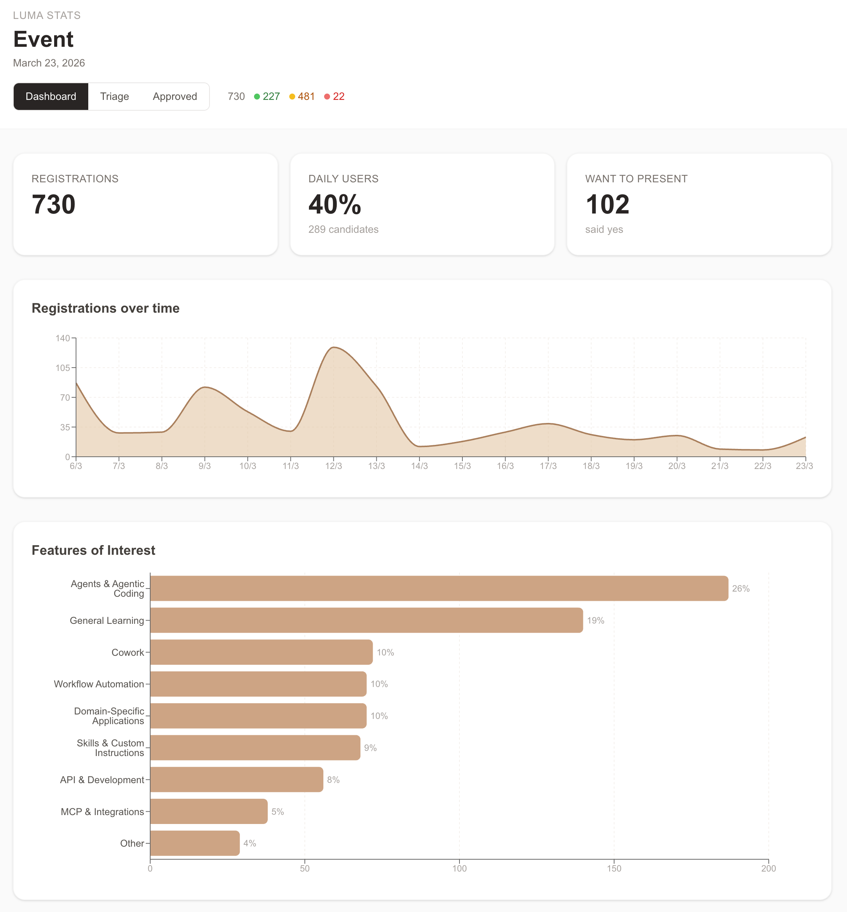
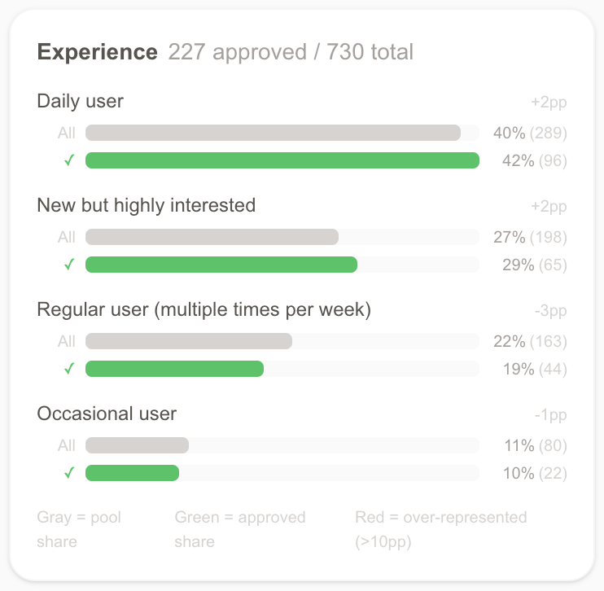

# Luma Stats

Dashboard for Claude ambassadors to visualize and triage Luma event registrations.

Drop your CSV, run one command, get a full dashboard with charts, triage tools, and an approved list.





## Prerequisites

- [Node.js](https://nodejs.org/) (LTS)
- [pnpm](https://pnpm.io/)
- [Claude CLI](https://docs.anthropic.com/en/docs/claude-code) (for processing your CSV)

## Quick Start

```bash
# 1. Clone and install
git clone <this-repo>
cd luma-stats
pnpm install

# 2. Export your guest list from Luma (CSV format)
#    Place it at data/list.csv

# 3. Process with Claude
pnpm process

# 4. Start the dashboard
pnpm dev
```

Open http://localhost:3000 to see your dashboard.

## How It Works

`pnpm process` calls Claude CLI to analyze your CSV. Claude:

- Detects standard Luma columns vs custom form questions
- Classifies qualitative fields (roles, industries, interests) into meaningful categories
- Computes a relevance score (0-100) for each candidate
- Decides which charts to show and how to configure the dashboard
- Outputs `data/processed.json` which the app reads

The app has 3 views (toggle at the top):

- **Dashboard** — Charts and stats overview
- **Triage** — Review and approve/decline candidates with balance tracking
- **Approved** — Filterable table of approved candidates

## Updating Data

When you get new registrations:

1. Re-export the full CSV from Luma
2. Replace `data/list.csv`
3. Run **`pnpm process:update`** — classifies only new candidates via LLM, reuses cached classifications for everyone else, and refreshes Luma fields (approval status, check-ins) for all rows.

Use `pnpm process` instead if you want to re-design categories from scratch (e.g. the form questions changed). Use `pnpm reprocess` to rebuild outputs from the cache without any LLM calls.

Your triage decisions and category overrides are persisted to `data/triage.json` and `data/overrides.json` via the app's API routes, keyed by candidate ID. They survive re-processing and dev-server restarts. (Existing localStorage entries auto-migrate to disk on first load.)

## Deploying to Vercel

1. Remove `data/processed.json` (and optionally `data/overrides.json`, `data/triage.json`) from `.gitignore`
2. Commit those files to your repo
3. Connect to Vercel and deploy

**Never commit `data/list.csv`** — it contains raw emails and personal data.

Note: Vercel's filesystem is read-only at runtime, so triage / override edits made on the deployed site won't persist. Do your curation locally; deploy as a read-only snapshot.

## Security & PII

This tool displays full candidate information (names, emails, LinkedIn URLs) by design — it's an internal ambassador tool for event curation.

If you deploy publicly, **protect access**:

- Use [Vercel Password Protection](https://vercel.com/docs/security/password-protection) (Pro plan)
- Or deploy behind your own authentication

The raw CSV (`data/list.csv`) is always gitignored and should never be committed.

## Custom Form Questions

The tool automatically detects custom columns in your Luma export. Claude analyzes each custom question and decides how to render it:

- Categorical data → filter chips + charts
- Free-text responses → detail fields in triage cards
- Yes/no questions → filters

You can customize the prompt at `scripts/prompt.md`.
